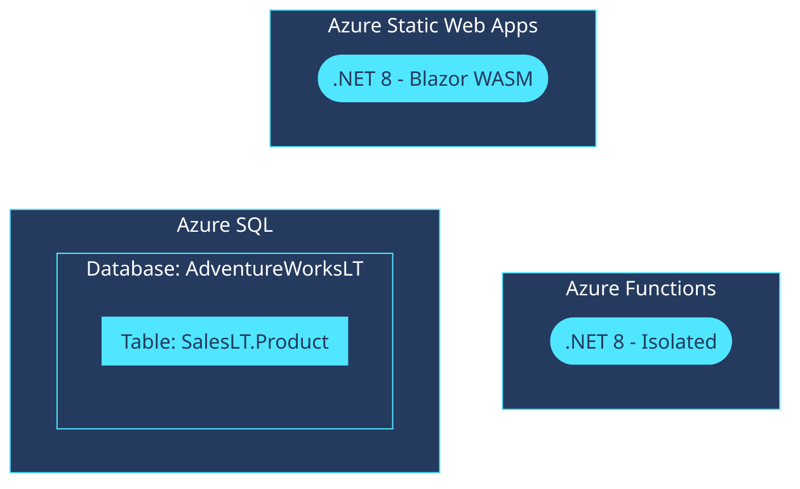

<!-- YAML front-matter schema: https://review.learn.microsoft.com/en-us/help/contribute/samples/process/onboarding?branch=main#supported-metadata-fields-for-readmemd -->


# Quickstart: Data API builder and Azure SQL database

This is a Blazor web application that illustrates using Data API builder with Azure SQL. This sample application uses a Blazor WebAssembly front-end to access an Azure SQL database using the [Data API builder](https://learn.microsoft.com/azure/data-api-builder), and business logic using Azure Functions. This quickstart makes use of the [Database connections feature of Azure Static Web Apps](https://learn.microsoft.com/azure/static-web-apps/database-overview).

This template illustrates these practices:

- Using a user-assigned managed identity to connect hosting and database services
  - Using the managed identity to connect the Azure Functions app to the Azure Storage service
  - Using the same managed identity to connect the Azure Static Web Apps to an Azure SQL server
  - Assigning the managed identity as the admin for the Azure SQL server
- Deploying Azure Functions and Azure Static Web App seperately
  - Linking the deployed function app to the static web app
- Deploying the AdventureWorksLT sample database to Azure SQL database
- Disabling local and key-based authentication to Azure SQL database and Azure Storage

## Prerequisites

> This template will create infrastructure and deploy code to Azure. If you don't have an Azure Subscription, you can sign up for a [free account here](https://azure.microsoft.com/free/). Make sure you have the contributor role in the Azure subscription.

The following prerequisites are required to use this application. Please ensure that you have them all installed locally.

- [Azure Developer CLI](https://aka.ms/azd-install)
- [.NET SDK 8.0](https://dotnet.microsoft.com/download/dotnet/8.0)

## Get started

Follow these steps to authenticate to Azure, initialize thetemplate, provision infrastructure in Azure, and deploy the code to Azure.

1. Log in to azd. Only required once per-install.

    ```shell
    azd auth login
    ```

1. Run the first-time project setup. Initialize a project in the current directory, using this template.

    ```shell
    azd init --template dab-azure-sql-quickstart
    ```

    > [!NOTE]
    > Omit the --template argument if you are running in a development container.

1. Provision the resources in Azure and deploy the application code.

    ```shell
    azd up
    ```

1. Navigate to the **Azure Static Web App** resource in the Azure portal.

1. Configure the static web app to add a **Database Connection** to the Azure SQL database. Ensure you use the built-in **user-assigned managed identity**.

    

    > [!TIP]
    > This template will be updated in the future to automate this step in the deployment.

1. **Browse** to the running web application.

    

## Configuration

In the application's code, open the *src/web/swa-db-connections/staticwebapp.database.config.json* configuration file. This file includes the configuration for the Data API builder client in Azure Static Web Apps:

```json
{
  "$schema": "https://github.com/Azure/data-api-builder/releases/latest/download/dab.draft.schema.json",
  "data-source": {
    "database-type": "mssql",
    "options": { "set-session-context": false },
    "connection-string": "@env('SQL_CONNECTION_STRING')"
  },
  "runtime": {
    "host": { "authentication": { "provider": "StaticWebApps" } }
  },
  "entities": {
    "product": {
      "source": "SalesLT.Product",
      "permissions": [ { "actions": [ "read" ], "role": "anonymous" } ]
    }
  }
}
```

## Application Architecture

This application utilizes the following Azure resources:

- [**Azure Static Web Apps**](https://learn.microsoft.com/azure/static-web-apps/)
    - This service hosts the ASP.NET Blazor WebAssembly web application
    - The data API is powered by [Data API builder](https://learn.microsoft.com/azure/data-api-builder/)
- [**Azure Functions**](https://learn.microsoft.com/azure/functions/)
    - This service hosts the .NET business logic API
- [**Azure SQL**](https://learn.microsoft.com/azure/azure-sql/) 
    - This service stores the SQL data
- [**Azure Storage**](https://learn.microsoft.com/azure/storage/)
    - This services stores the Azure Functions metadata

Here's a high level architecture diagram that illustrates these components. Notice that these are all contained within a single **resource group**, that will be created for you when you create the resources.



## Cost of provisioning and deploying this template

This template provisions resources to an Azure subscription that you will select upon provisioning them. Refer to the [Pricing calculator for Microsoft Azure](https://azure.microsoft.com/pricing/calculator/) to estimate the cost you might incur when this template is running on Azure and, if needed, update the included Azure resource definitions found in [`infra/main.bicep`](infra/main.bicep) to suit your needs.

## Tooling

This template is structured using the [Azure Developer CLI](https://aka.ms/azure-dev/overview). You can learn more about `azd` architecture in [the official documentation](https://learn.microsoft.com/azure/developer/azure-developer-cli/make-azd-compatible?pivots=azd-create#understand-the-azd-architecture).

## Next steps

At this point, you have a complete application deployed on Azure. But there is much more that the Azure Developer CLI can do. These next steps will introduce you to additional commands that will make creating applications on Azure much easier. Using the Azure Developer CLI, you can setup your pipelines, monitor your application, test and debug locally.

- [`azd pipeline config`](https://learn.microsoft.com/azure/developer/azure-developer-cli/configure-devops-pipeline?tabs=GitHub) - to configure a CI/CD pipeline (using GitHub Actions or Azure DevOps) to deploy your application whenever code is pushed to the main branch. 

- [`azd down`](https://learn.microsoft.com/azure/developer/azure-developer-cli/reference#azd-down) - to delete all the Azure resources created with this template 
