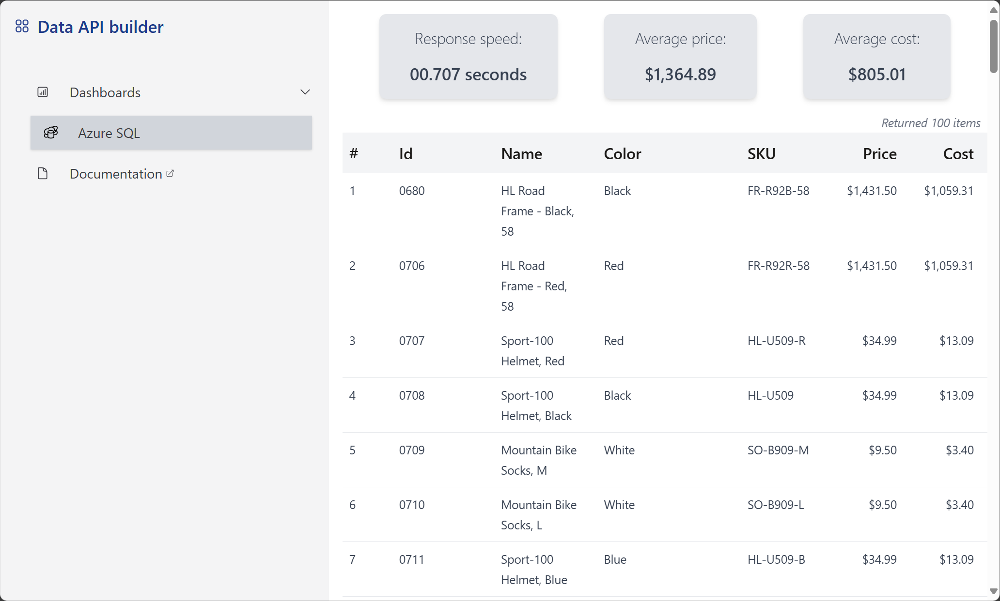
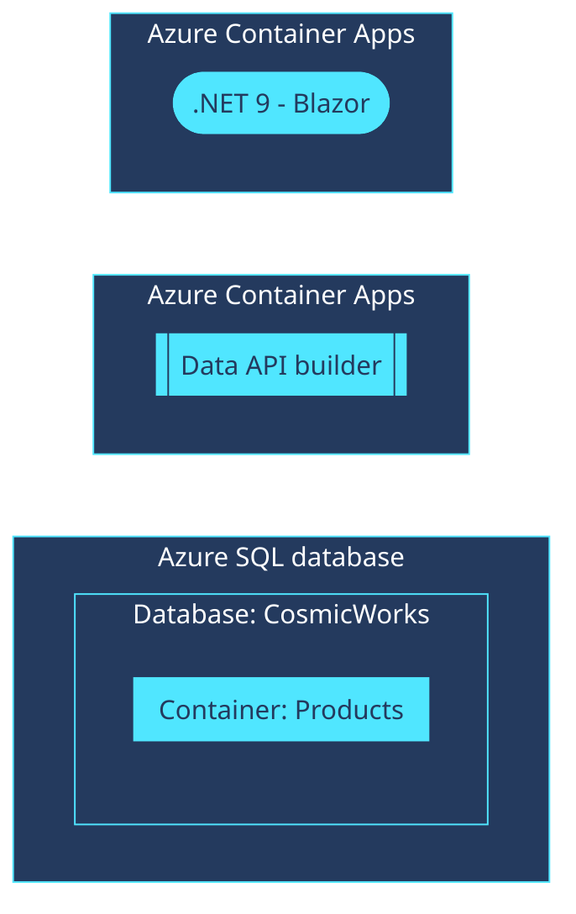

<!--
---
page_type: sample
name: "Quickstart: Data API builder and Azure SQL database"
description: This is an ASP.NET Blazor web application that illustrates using Data API builder with Azure SQL database.
urlFragment: template
languages:
- csharp
- azdeveloper
- data-api-builder
products:
- azure-sql-database
- azure-container-apps
---
-->

# Quickstart: Data API builder and Azure SQL database

This is an ASP.NET Blazor web application that illustrates using Data API builder with Azure SQL database. This sample application uses a Blazor front-end to access an Azure SQL database account using the [Data API builder](https://learn.microsoft.com/azure/data-api-builder) container image.

This template illustrates these practices:

- Using a user-assigned managed identity to connect hosting and database services
  - Using managed identity to connect Azure Container Apps containers to an Azure SQL database account
  - Assigning managed identity as the admin for the Azure SQL database account
- Deploying a AdventureWorks-derived sample database to Azure SQL database
- Disabling local and key-based authentication to Azure SQL database

## Prerequisites

> This template will create infrastructure and deploy code to Azure. If you don't have an Azure Subscription, you can sign up for a [free account here](https://azure.microsoft.com/free/). Make sure you have the contributor role in the Azure subscription.

The following prerequisites are required to use this application. Please ensure that you have them all installed locally.

- [Azure Developer CLI](https://aka.ms/azd-install)
- [.NET SDK 9.0](https://dotnet.microsoft.com/download/dotnet/9.0)

## Get started

Follow these steps to authenticate to Azure, initialize thetemplate, provision infrastructure in Azure, and deploy the code to Azure.

1. Log in to azd. Only required once per-install.

    ```shell
    azd auth login
    ```

1. Run the first-time project setup. Initialize a project in the current directory, using this template.

    ```shell
    azd init --template dab-azure-sql-quickstart
    ```

1. Provision the resources in Azure and deploy the application code.

    ```shell
    azd up
    ```

1. Navigate to the running web application.

    

> [!TIP]
> Azure Developer CLI will output the URL of the web application after deployment.

## Application Architecture

This application utilizes the following Azure resources:

- [**Azure Container Apps**](https://learn.microsoft.com/azure/container-apps/)
    - This service hosts the ASP.NET Blazor web application
    - This service also hosts the Data API builder container
- [**Azure SQL database**](https://learn.microsoft.com/azure/azure-sql/database/) 
    - This service stores the relational data

Here's a high level architecture diagram that illustrates these components. Notice that these are all contained within a single **resource group**, that will be created for you when you create the resources.



## Cost of provisioning and deploying this template

This template provisions resources to an Azure subscription that you will select upon provisioning them. Refer to the [Pricing calculator for Microsoft Azure](https://azure.microsoft.com/pricing/calculator/) to estimate the cost you might incur when this template is running on Azure and, if needed, update the included Azure resource definitions found in [`infra/main.bicep`](infra/main.bicep) to suit your needs.

## Tooling

This template is structured using the [Azure Developer CLI](https://aka.ms/azure-dev/overview). You can learn more about `azd` architecture in [the official documentation](https://learn.microsoft.com/azure/developer/azure-developer-cli/make-azd-compatible?pivots=azd-create#understand-the-azd-architecture).

## Next steps

At this point, you have a complete application deployed on Azure. But there is much more that the Azure Developer CLI can do. These next steps will introduce you to additional commands that will make creating applications on Azure much easier.

- [`azd down`](https://learn.microsoft.com/azure/developer/azure-developer-cli/reference#azd-down) - to delete all the Azure resources created with this template

## Attributions

This project uses 

- [TailwindCSS](https://github.com/tailwindlabs/tailwindcss), licensed under the MIT License
- [HeroIcons](https://github.com/tailwindlabs/heroicons), licensed under the MIT License
